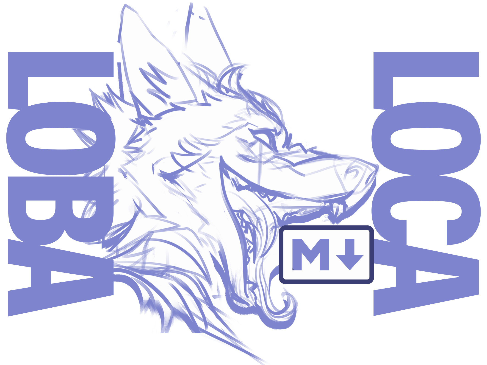

# 🐺 mdvu v1.0.2

a minimal, offline browser-based dark-themed markdown viewer. drag n drop a `.md` file onto the page. doesn't upload or anything, completely local

## features

- drag & drop or click to open `.md` / `.markdown` / `.txt` files
- syntax highlighting via highlight.js (github-dark theme)
- scroll progress bar
- fully local. files stay on your machine
- live-updates any edits you save to the file (chrome/desktop only)

## stack

- [Astro](https://astro.build)
- [Svelte 5](https://svelte.dev)
- [marked](https://marked.js.org) — markdown parsing
- [highlight.js](https://highlightjs.org) — code highlighting

## dev

```bash
npm install

# web (browser)
npm run dev

# desktop (electron)
npm run electron:preview
```

## build

```bash
# web → dist/
npm run build

# desktop installer → release/
npm run electron:dist
```

## roadmap
- i really don't know man.


## license

MIT
